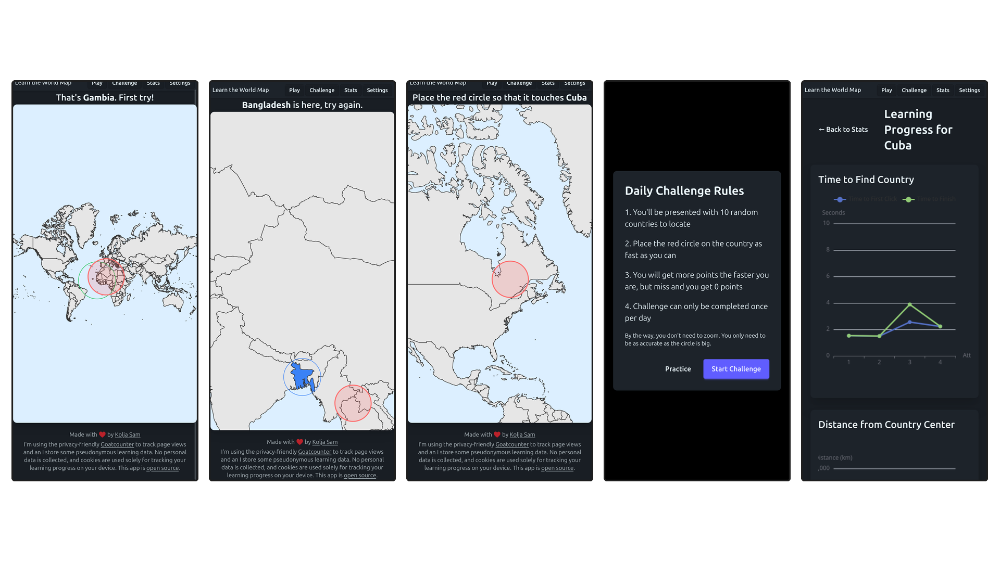

# Learn the Worldmap


_do you know where the countries are?_

**[Play the free online practice game](https://map.koljapluemer.com)**

[](https://ko-fi.com/S6S81CWUVD)

## Features

1. Spaced-Repetition based selection of which country should be learned
2. As the learner gets better, they have to find a given country with more precision
3. Detailed statistics about how learning a country is going
4. *WIP:* Daily Challenge Mode
5. *Planned:* Custom Playlist Mode to practice exactly what you want to practice





## Development

First of all: Feedback is welcome, bug reports are welcome, contributions are welcome. If anything's unclear, head over to issues and write what's on your mind.

### Running It

1. Clone the repository
2. Make sure you have `npm` installed
3. Run `npm i`
4. Run `npm run dev` and open the displayed link in your browser

### Folder Structure

This project follows a module-based approach, similar to the one explained in [this video](https://www.youtube.com/watch?v=iuyzO2QkY7A).

You will not find folders such as `composables/` or `components/` here, as is custom in many vue projects.
Instead, code is separated across features, with the intent that changes to feature X or use case Y can be done in the 
folder dedicated for it, instead of all across the codebase.

Below, you can find an overview of core folders and files:


```shell
├── App.vue                                       # wrapper rendering header, footer & router view
├── main.ts                                       # boilerplate/setup
├── modules                                       # everything is a module!
│   ├── map-data                                  #
│   │   ├── mapData.ts                            # handling/exposing the map data 
│   │   └── woldmap.geo.json                      # the JSON file with the map data
│   ├── misc-views                                #
│   │   └── stats-view                            # everything you see in "stats"
│   │       ├── main-stats                        #
│   │       │   └── StatsView.vue                 #
│   │       └── per-country-stats                 # 
│   │           ├── CountryStatsView.vue          #
│   │           ├── DistanceProgressChart.vue     #
│   │           └── TimeProgressChart.vue         #
│   ├── play                                      # everything related to core gameplay
│   │   ├── map-renderer                          #
│   │   │   ├── useCustomCursor.ts                # relating to the cursor-circle
│   │   │   ├── WorldMapGame.vue                  # a gameplay-wrapper around the world map, calling the cursor 
│   │   │   └── WorldMap.vue                      # the world map itself
│   │   └── play-modes                            #
│   │       ├── challenge-play                    #
│   │       │   ├── PlayChallengeView.vue         # Renders the challenge view via 3 sub-components
│   │       └── standard-play                     #
│   │           ├── PlayStandardView.vue          #
│   │           └── standard-play-progress-bar    # unused stump to render a progress bar 
│   ├── randomness                                # helper functions for seeded randomness
│   ├── shared-types                              #
│   │   └── types.ts                              # if a type is needed across the app, put it here
│   └── spaced-repetition-learning                #
│       ├── calculate-learning                    # using ts-fsrs and dexie to calculate and persist learning data
│       └── log-learning                          # storing anonymous learning data on a firebase server
├── router.ts                                     # all the routes (game modes, stats, home...)
├── style.css                                     # this should stay empty, since we're using Tailwind/Daisy
├── tests                                         #
```

### Module Documentation

- [map-data](src/modules/map-data/.doc.md)


### Testing

For now, there are some E2E tests, which were recorded with Playwright.
You'll find them in the `tests/` directory.

To run them, execute the app with the test env var set, by running:

```
npm run testdev
```

Leave this running, and in another terminal, run the tests:

```
npm run test:e2e
```